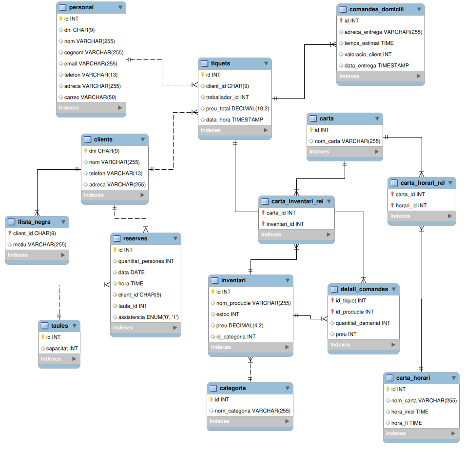

# M02UF2-PE03_DDL

Aquest és un sistema de gestió per a un kebab, destinat a gestionar la seva carta, les reserves de taules, les comandes a domicili i la informació del personal.

## Descripció del Projecte

El nostre sistema consta del següent:

### Carta del Kebab

Gestionem una carta que inclou diversos productes. Cada plat té ingredients base als quals els comensals poden afegir els que desitgin. Guardem l'estoc disponible, la categoria i el nom de cada ingredient.

### Reserves de Taules

Registrem les reserves de taules, incloent-hi la quantitat de persones, la data i hora de la reserva, i les dades del client. En cas d'absència sense avís, el client es pot afegir a una llista negra.

### Taules del Restaurant

Tenim un sistema per gestionar les diferents taules del restaurant, identificades per un id i amb capacitat variable.

### Comandes a Domicili

Registrem les comandes a domicili, amb les dades del client, adreça de lliurament, temps estimat de preparació i valoració del client.

### Registre de Tiquets

Registrem les comandes tant a domicili com al restaurant amb un tiquet que inclou l'identificador del client, el treballador que ha pres la comanda, el preu total i la data.

### Informació del Personal

Registrem dades del personal, incloent-hi DNI, nom, cognom, email, telèfon, adreça i càrrec (repartidor, cambrer, etc.).

## Estructura de la Base de Dades

Les taules de la base de dades estan definides de la següent manera:

- **Carta**
  - `id`: Identificador del producte
  - `nom_producte`: Nom del producte
  - `categoria`: Categoria del producte

- **Ingredients**
  - `id`: Identificador de l'ingredient
  - `nom`: Nom de l'ingredient
  - `estoc`: Estoc disponible de l'ingredient
  - `categoria`: Categoria de l'ingredient

- **Reserves de Taules**
  - `id`: Identificador de la reserva
  - `quantitat_persones`: Nombre de persones per a la reserva
  - `data`: Data de la reserva
  - `hora`: Hora de la reserva
  - `client_id`: Identificador del client que ha fet la reserva
  - `assistencia`: Indica si el client ha assistit a la reserva

- **Taules del Restaurant**
  - `id`: Identificador de la taula
  - `capacitat`: Capacitat de la taula

- **Comandes a Domicili**
  - `id`: Identificador de la comanda
  - `client_id`: Identificador del client que ha fet la comanda
  - `adreca_entrega`: Adreça de lliurament de la comanda
  - `temps_estimat`: Temps estimat de preparació de la comanda
  - `valoracio_client`: Valoració del client per la comanda (de 1 a 10)

- **Registre de Tiquets**
  - `id`: Identificador del tiquet
  - `client_id`: Identificador del client que ha fet la comanda
  - `treballador_id`: Identificador del treballador que ha pres la comanda
  - `preu_total`: Preu total de la comanda
  - `data_hora`: Data i hora de la comanda

- **Informació del Personal**
  - `id`: Identificador del treballador
  - `dni`: DNI del treballador
  - `nom`: Nom del treballador
  - `cognom`: Cognom del treballador
  - `email`: Correu electrònic del treballador
  - `telefon`: Telèfon del treballador
  - `adreca`: Adreça del treballador
  - `carrec`: Càrrec del treballador

## Instruccions d'Ús

1. Clona aquest repositori: [M02UF2-PE03_DDL](https://github.com/laasso/M02UF2-PE03_DDL)
2. Importa la base de dades MySQL: `mysql -u el_teu_usuari -p kebab < kebab.sql`
3. Ja estàs llest per utilitzar el sistema!

## Contribució

Si desitges contribuir al desenvolupament d'aquest projecte, estem oberts a col·laboracions. No dubtis en enviar pull requests.

## Llicència

Aquest projecte està sota la llicència [MIT](LICENSE).

## Estat del Projecte

